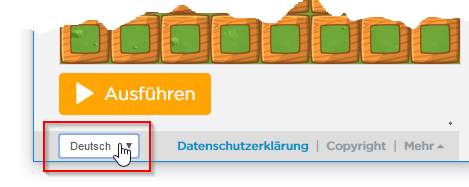
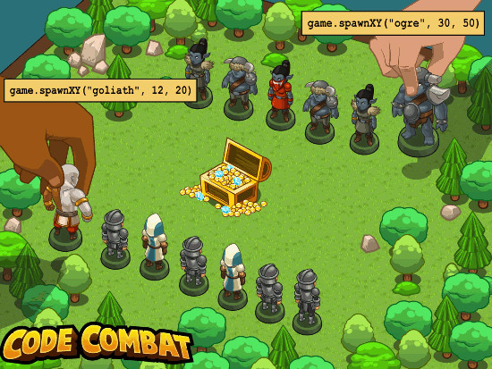

# Programmieren lernen mit *Hour of Code*

## Anfänger: Programmieren mit Blöcken
**Hinweis**
Die "Hour of Code" Anleitungen beinhalten Videos in Englisch mit meist deutschem Untertitel. Man kann den Untertitel bei den Video Einstellungen einschalten. Nicht alle Videos haben deutsche Untertitel, beachte die Hinweise auf dieser Seite.

1. {: .right}
Kennst du den *BB-8* aus Star Wars? In *Hour of Code* bist du für seine Programmierung zuständig. Programmierspiel unter [https://hourofcode.com/star-wars](https://studio.code.org/s/starwarsblocks/stage/1/puzzle/1){:target="_blank"} starten... 
**Was lernst du:** Einfache Befehle und Ereignisse (events) 
**Schwierigkeit: *Einfach*** 

1. {: .right}
In *Hour of Code* kannst du auch dein eigenes Spiel programmieren! Probiere z.B. die Flappy-Code-Anleitung unter [https://studio.code.org/flappy](https://studio.code.org/flappy/1){:target="_blank"} 
**Was lernst du:** Einfache Befehle und Ereignisse (events) 
**Schwierigkeit: *Einfach*** 

1. {: .right}
Kennst du das Spiel *Angry Birds* von Smartphone oder Tablet? In *Hour of Code* kannst du die ersten Schritte des Programmierens mit den *Angry Birds* erlernen. Programmierspiel unter [https://studio.code.org/hoc](https://studio.code.org/hoc/1){:target="_blank"} starten... 
**Was lernst du:** Einfache Befehle, Schleifen (loops) und Bedingungen/Verzweigungen (if-then) 
**Schwierigkeit: *Mittel*** 

1. {: .right}
Helfe Vaiana und Maui Fische zu fangen und die Kokomora zu besiegen. Programmierspiel unter [https://partners.disney.com/hour-of-code/wayfinding-with-code](https://partners.disney.com/hour-of-code/wayfinding-with-code){:target="_blank"} starten... 
**Was lernst du:** Einfache Befehle, Schleifen (loops) und Bedingungen/Verzweigungen (if-then) 
**Schwierigkeit: *Mittel*** 

1. {: .right}
Wusstest du, dass es auch Minecraft-Varianten gibt, mit denen du Programmieren lernen kannst? In *Hour of Code* programmierst du die Handlungen von *Alex* oder *Steve*. Programmierspiel unter [https://studio.code.org/s/mc](https://studio.code.org/s/mc/reset){:target="_blank"} starten... 
**Was lernst du:** Einfache Befehle, Schleifen (loops) und Bedingungen/Verzweigungen (if-then) 
**Schwierigkeit: *Mittel*** 
**Hinweis:** Drücke auf "Weniger" wenn der Text nicht auf Deutsch ist. _(Das ist ein Programmfehler)_

1. {: .right}
Stehst du auf Musik und Party? In *Hour of Code* kannst du eine Tanzparty codieren, um sie mit deinen Freunden zu teilen. Programmierspiel unter [https://studio.code.org/s/dance](https://studio.code.org/s/dance/reset){:target="_blank"}  starten... 
**Was lernst du:** Einfache Befehle, Ereignisse (Events), Eigenschaften (Properties) 
**Schwierigkeit: *Mittel*** 
**Hinweis:** Video hat keine deutschen Untertitel

1. {: .right}
Bist du ein Fan von Anna und Elsa? In *Hour of Code* kannst du ihre Bewegungen programmieren und damit schöne Muster aufs Eis zeichnen. Programmierspiel unter [https://hourofcode.com/frzn](https://hourofcode.com/frzn){:target="_blank"} starten... 
**Was lernst du:** Einfache Befehle, Schleifen (loops) und Funktionen (functions) 
**Schwierigkeit: *Schwierig*** (Rechnen mit Winkeln) 

1. {: .right}
Male schöne Muster mit dem Künstler ähnlich wie mit der Eiskönigin. Programmierspiel unter [http://studio.code.org/s/artist](http://studio.code.org/s/artist/reset){:target="_blank"} starten... 
**Was lernst du:** Einfache Befehle, Schleifen (loops) und Funktionen (functions) 
**Schwierigkeit: *Schwierig***(Rechnen mit Winkeln) 
**Hinweis:** Drücke auf "Weniger" wenn der Text nicht auf Deutsch ist.

1. {: .right}
**Tipp:** Die *Hour of Code* Programmierspiele gibt es in vielen Sprachen. Du kannst die Sprache links unten im Browser-Fenster beim jeweiligen Spiel einstellen.

## Fortgeschrittene: Scratch

Bei den oben erwähnten Spielen folgst du vorgegebenen Übungsaufgaben. Du möchtest jetzt anfangen, deine eigenen Ideen umzusetzen? Dafür ist [Scratch](http://scratch.mit.edu) super geeignet.

1. Das [CoderDojo Linz](http://coderdojol-linz.github.io){:target="_blank"} hat bereits [eine Menge Beispiele](http://coderdojoluzern.ch/infos/uebungsbeispiele.html){:target="_blank"} ausgearbeitet die wir übernehmen konnten und mit denen du starten kannst. Hast du eigene Ideen für Änderungen oder Erweiterungen? In Scratch kannst du deinen Ideen freien Lauf lassen.
1. Auch in *Hour of Code* gibt es Scratch-Beispiele. Unter [https://hourofcode.com/scratchmus](https://hourofcode.com/scratchmus){:target="_blank"} kannst du zum Beispiel deine eigene Musik programmieren.
1. Auf der Webseite von [Raspberry Pi](https://www.raspberrypi.org){:target="_blank"} gibt es [einige Scratch Projekte auf Deutsch](https://projects.raspberrypi.org/de-DE/projects?software%5B%5D=scratch&curriculum%5B%5D=%201){:target="_blank"}, die sich besonders für Anfänger eignen.

## Der nächste Schritt: Spiel programmieren mit *JavaScript* oder *Python*

1. {: .right}
Du hast schon Erfahrung mit grafischer Programmierung. Scratch-Spiele sind dir nicht mehr genug? Profis verwenden Programmiersprachen wie *JavaScript* oder *Python*. Im Spiel [Code Combat](https://codecombat.com/){:target="_blank"} kannst du die Grundlagen dieser Sprachen erlernen und dabei dein eigenes Spiel programmieren. 

1. Auf der Webseite von [Raspberry Pi](https://www.raspberrypi.org){:target="_blank"} gibt es einige [Python Projekte auf Deutsch](https://projects.raspberrypi.org/de-DE/projects?software%5B%5D=python)
