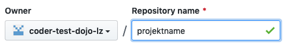
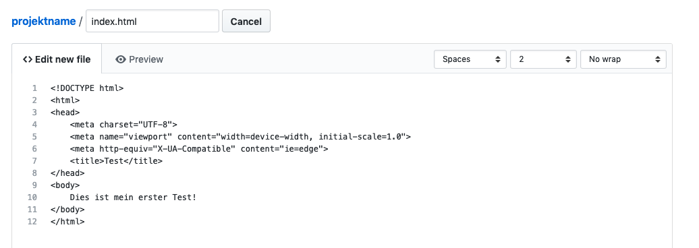
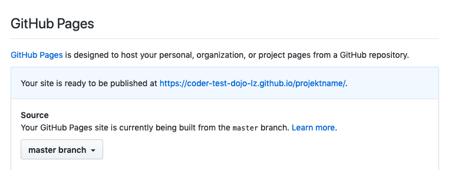
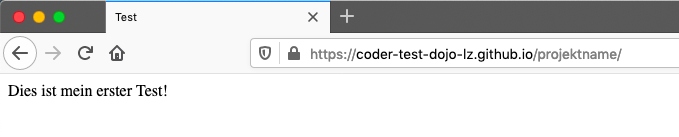
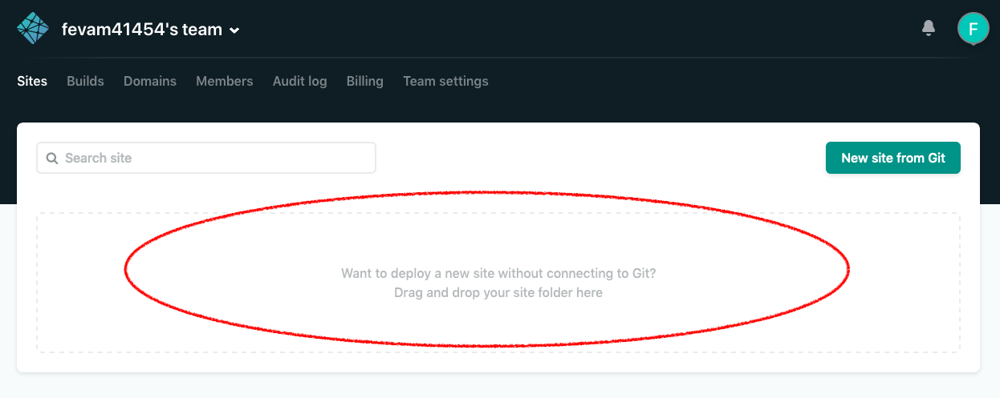
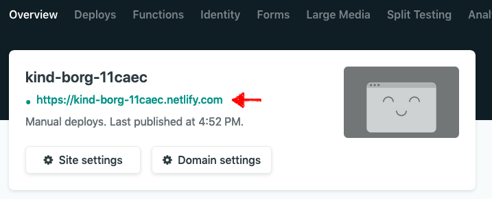
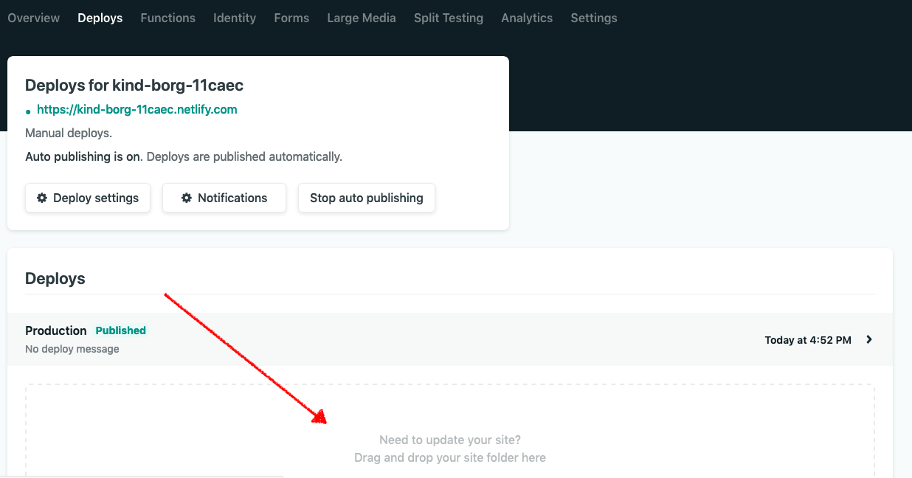

# Deine erste Webseite veröffentlichen

## Ziel der Übung

Auf unserer [Trainingsübersicht](/infos/uebungsbeispiele.html){:target="_blank"} findest du viele Beispiele, die dir zeigen, wie du deine erste Webseite baust. So richtig Spaß macht das aber erst, wenn man das Ergebnis auch tatsächlich ins Internet stellen kann, oder? Genau das machen wir in dieser Übung.

Es gibt viele Dienste, die es dir ermöglichen deine Webseite live zu stellen. Wir stellen dir hier zwei Optionen vor:

_Bemerkung: Diese beiden Dienste sind hauptsächlich für statische Dateien (HTML, CSS, JavaScript, Bilder etc.) ausgelegt. Wenn du serverseitig mehr Optionen benötigst, musst du evtl. auf eine Alternative ausweichen. Am besten fragst du einen Mentor über mehr Infos._

## [GitHub](github.com/)

GitHub ist eigentlich ein Dienst, der es Programmieren einfacher macht, Code auszutauschen und zusammenzuarbeiten.

Wir können aber auch deine Webseite dort «hosten». (Das bedeutet, dass dieser Dienst für uns die Webseite im Internet verfügbar macht).

### Schritt 1: Benutzer anlegen

Gehe auf die [GitHub-Webseite](github.com/) und eröffne dort ein Konto (_Sign up_), wenn du noch keines hast.

### Schritt 2: Projekt anlegen

Auf GitHub nennen wir ein Projekt auch _Repository_. Sobald du dich erfolgreich auf GitHub angemeldet hast, kannst du ein neues Repository erstellen:

Du kannst das mit «Create repository» starten.

### Schritt 3: erste Daten hochladen

In deinem neuen Repository werden dir verschiedene Optionen vorgeschlagen, wie du beginnen kannst. Die einfachsten sind:

* ein neues Dokument erstellen (_creating a new file_)
* ein bestehendes Dokument hochladen (_uploading an existing file_)

Wähle eines der beiden Optionen und sorge am besten für einen ersten Test dafür, dass du ein Dokument mit dem Namen `index.html` hochlädst oder erstellst.

_Hinweis: Zum Änderungen in GitHub zu speichern, klicke jeweils auf den Button «Commit [...]»_

### Schritt 4: Repository live stellen

Gehe in die Einstellungen (_Settings_) deines Repository.

Finde dort den Abschnitt «GitHub Pages» und aktiviere unter Quelle (_Source_) deinen sogenannten «master branch».

Deine Seite wird nun neugeladen. Wenn du wieder zu «GitHub Pages» gehst, solltest du dort nun eine Webadresse erhalten:

Klicke auf diesen Link. Siehst du nun deine Webseite? Gratulation, deine Webseite ist nun im Internet!

### Danach: Webseite anpassen

Um deine Webseite anzupassen, wechsle auf die Code-Seite deines Repository.

Hier kannst du diese drei Möglichkeiten ausprobieren:

* A: Klicke auf ein bestehendes Dokument, um es anzupassen
* B: Erstelle ein neues Dokument
* C: Lade ein bestehendes Dokument von deinem Computer hoch

## [Netlify](https://www.netlify.com/)

Netlify wurde genau für den Zweck erstellt, möglichst bequem statische Dokumente, wie eine Webseite zu hosten.

Wie auch GitHub (oben) kann Netlify sehr viel – lass dich nicht von all dem ablenken oder abschrecken.

Die folgene Anleitung hilft dir dabei deine erste Webseite per Netlify ins Internet zu bringen.

### Schritt 1: Benutzer anlegen

Gehe auf die [Netlify-Webseite](https://www.netlify.com/) und eröffne dort ein Konto (_Sign up_), wenn du noch keines hast.

### Schritt 2: Projekt anlegen

Auf Netlify werden Projekte «Site» (Deutsch: Seite) genannt.

Am besten erstellst du die Webseite bei dir lokal auf dem Computer (alles in einem Ordner). Danach kannst du den ganzen Ordner auf Netlify ziehen:

### Schritt 5: Webseite anschauen

Nach einer kurzen Wartezeit, erhältst du oben links die Webadresse für deine Webseite:

Klicke auf diesen Link. Siehst du nun deine Webseite? Gratulation, deine Webseite ist nun im Internet!

_Hinweis: Möchtest du diese Adresse anpassen? Dann klicke auf «Site Settings» und finde den Button «Change site name»_

### Danach: Webseite anpassen

Passe deine Webseite wieder lokal auf deinem Computer an.

Wechsle dann auf die Deploy-Seite deines Projektes auf Netlify.

Dort findest du zuunterst wieder ein Bereich, wo du den ganzen Ordner hochladen bzw. reinziehen kannst:

## Weitere Übungen

1. Kennst du dich mit HTML schon aus? Falls nicht, schau dir die Übung [Meine erste Webseite](/trainingsanleitungen/web/html-meine-erste-webseite.html) an.

2. Möchtest du deine Webseite hübscher machen? In der Übung [Erste Schritte mit CSS](/trainingsanleitungen/web/erste-schritte-mit-css.html) lernst du, wie das geht.

3. Bist du schon sehr erfahren was HTML, JavaScript, Node.js etc. betrifft? Dann schau dir die Übung [Erstellen und Bereitstellen einer Node.js-Web-App in Azure App Service](https://azure.microsoft.com/de-de/documentation/articles/web-sites-nodejs-develop-deploy-mac/) an. Das ist ein Lernprogramm, das auch Programmier-Profis verwenden, um erste Schritte mit Azure Web Apps zu erlernen.
